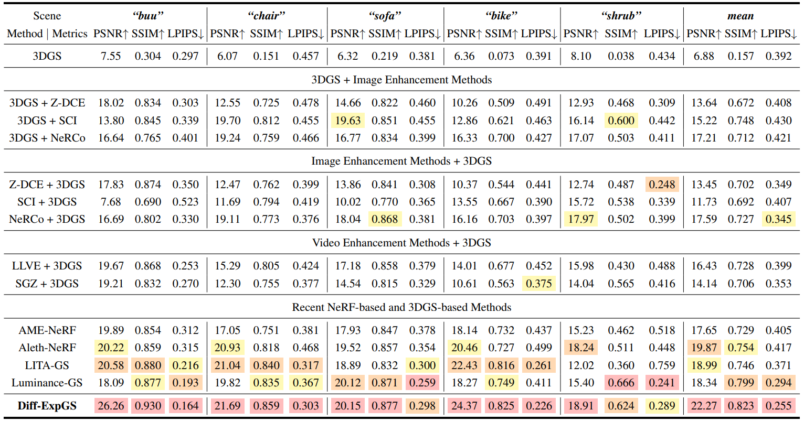
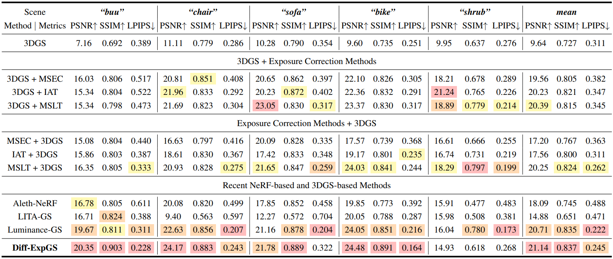
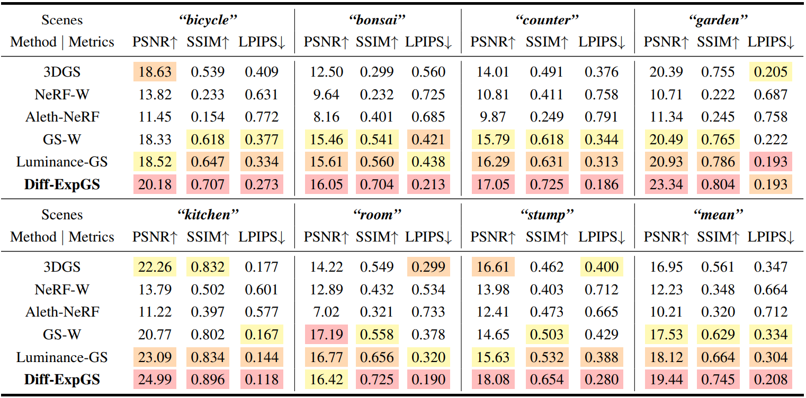
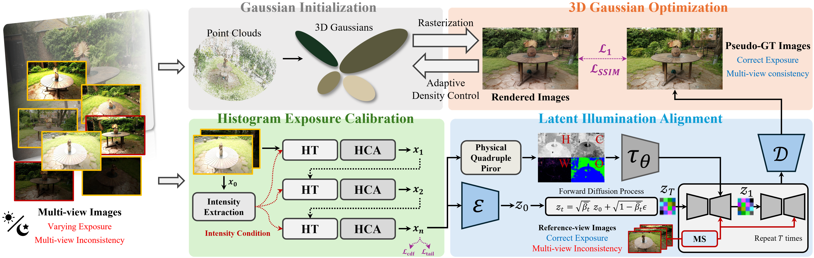

<div align="center">
<h1><strong>Seeing in The Right Light: Harmonizing Illumination in 3D Gaussian Splatting with Calibrated Multi-view Diffusion Priors</strong></h1>

<p align="center">
    <a href='https://scholar.google.com/citations?user=5C9TeqgAAAAJ&hl=ko/' target='_blank'>Cheolhoon Park</a><sup>1</sup>&emsp;
    <a href='https://github.com/coldbell8918/' target='_blank'>Jongchan Park</a><sup>1</sup>&emsp;<br>
<a href='https://scholar.google.com/citations?user=4Q-TY8YAAAAJ&hl=ko&oi=ao/' target='_blank'>Woojin Ahn</a><sup>3</sup>&emsp;
    <a href='https://scholar.google.com/citations?user=SIfp2fUAAAAJ&hl=ko&oi=ao/' target='_blank'>Hyunduck Choi</a><sup>2</sup>&emsp;
    <a href='https://scholar.google.com/citations?user=scecuqcAAAAJ&hl=ko&oi=ao/' target='_blank'>Myotaeg Lim</a><sup>1,†</sup>&emsp;<br>
<sup>1</sup>Korea University,&nbsp;&nbsp;&nbsp;&nbsp; <sup>2</sup>SeoulTech,&nbsp;&nbsp;&nbsp;&nbsp; <sup>3</sup>Inha University
</p>

[//]: # (<div>)

[//]: # (    <h4 align="center">)

[//]: # (        • <a href="https://github.com/towardsDLCV/RBaIR" target='_blank'>arXiv 2025</a> •)

[//]: # (    </h4>)

[//]: # (</div>)

<div align="center">
  <a href="https://github.com/towardsDLCV/">
    
  </a>
  <a href="https://github.com/towardsDLCV/">
    
  </a>
</div>

<p align="center">
  
</p>

## Abstract
</div>

>Recent advances in 3D Gaussian Splatting (3DGS) have achieved high-fidelity scene reconstruction but remain highly dependent on images captured under uniform illumination. In the real-world, variations in natural lighting and camera exposure cause cross-view illumination drift, leading to color inconsistencies and degraded rendering quality. We present Diff-ExpGS, a 3D scene restoration framework that integrates calibrated diffusion priors into 3DGS to perform multi-view illumination alignment and exposure restoration. However, introducing diffusion priors into the 3D pipeline raises a key challenge because pretrained diffusion models reconstruct each view independently, which produces brightness and tone inconsistencies. To address this, we propose Latent Illumination Alignment (LIA) module that calibrates the diffusion process to multi-view inputs and aligns reference-view illumination in the latent space for consistent lighting. The Histogram Exposure Calibration (HEC) further restores illumination-invariant priors under extreme exposure imbalance via histogram transformer and hybrid tone adjustment. By integrating calibrated diffusion priors, Diff-ExpGS enhances the intrinsic illumination consistency of 3DGS, enabling physically consistent and lighting-stable 3D reconstruction under diverse real-world conditions. Extensive experiments demonstrate that Diff-ExpGS achieves superior 3D scene reconstruction fidelity compared to NeRF- and 3DGS-based methods.

## ⚙️ Installation and Data Preparation

See 📄 [INSTALL.md](INSTALL.md) for the installation of dependencies and dataset preparation required to run this codebase.

## 📊 Evaluation on Illumination Scenarios

Comparison of PSNR, SSIM, and LPIPS metrics under varying illumination conditions. Our Diff-ExpGS consistently outperforms existing NeRF and 3DGS-based methods.

<details>
<summary><strong>🌙 Low-light Scene Results</strong> (Click to expand)</summary>
<br>
<div align="center">
  
</div>
</details>

<br>

<details>
<summary><strong>☀️ Overexposure Scene Results</strong> (Click to expand)</summary>
<br>
<div align="center">
  
</div>
</details>

<br>

<details>
<summary><strong>🌤️ Varying Exposure Scene Results</strong> (Click to expand)</summary>
<br>
<div align="center">
  
</div>
</details>

---

We provide rendered test images and reconstructed 3D Gaussian `.ply` files for all scenes, including low-exposure, over-exposure, and varying-exposure settings.

- 📂 **[Download Visual Results & .ply Files](https://drive.google.com/file/d/1ZOTSypNpTJqqaBAl45ENuxPvvEr0LlSk/view?usp=drive_link)** 

> The `.ply` files can be easily visualized using [SuperSplat](https://superspl.at/editor).

To reconstruct your own custom dataset, you must first run **COLMAP** to estimate camera poses. Please ensure that the estimated poses are saved in a COLMAP-compatible format.

## 🔥 Restoring

<p align="center">
  
</p>

To easily reproduce our results on different benchmarks, please follow the instructions below.

- Low-light & Overexposure Scenes: 
```bash
# Usage: bash scripts/restoring_lom.sh <IMAGE_TYPE> <DATASET_ROOT>
# <IMAGE_TYPE>: Choose between "low" or "over_exp"
bash scripts/restoring_lom.sh "<$IMAGE_TYPE>" "<$DATASET_ROOT>"
```

- Varying Exposure Scenes: 
```bash
# Usage: bash scripts/restoring_varying_nerf.sh <DATASET_ROOT>
bash scripts/restoring_varying_nerf.sh "<$DATASET_ROOT>"
```

The restored 3DGS outputs will be saved under `outputs/IMAGE_TYPE` directory.

<details>
<summary><strong> 📝 Command Line Arguments for run_iir_train.py</strong></summary>

  ```bash
  python run_iir_train.py -s ./data/NeRF_360/bicycle -m outputs/varying/bicycle --target_exp 0.6 --stage 3 --max_iteration 150  
  ```

  #### --source_path / -s
  Path to the source directory containing a COLMAP or Synthetic NeRF data set.

  #### --model_path / -m
  #### Path where the trained model should be stored (output/<random> by default).

  #### --images / -i
  #### Alternative subdirectory for COLMAP images (images by default).

  #### --eval
  #### Add this flag to use a MipNeRF360-style training/test split for evaluation.

  #### --target_exp
  #### Specifies the target exposure level for illumination alignment.

  #### --max_iteration
  #### Sets the number of optimization iterations for the Histogram Exposure Calibration (HEC) module.

  #### --stage
  #### Defines the number of Histogram Transformer (HT) layers used within the HEC module.

</details>

## 🔗 Citation

If you find our work useful, please consider citing:

> *Coming Soon*

## 🙏 Acknowledgement
Our code is based on the implementation of [**3DGS**](https://github.com/graphdeco-inria/gaussian-splatting), [**QuadPrior**](https://github.com/daooshee/QuadPrior/tree/main), and [**Luminance-GS**](https://github.com/cuiziteng/Luminance-GS/tree/main). We thank their excellent works.

